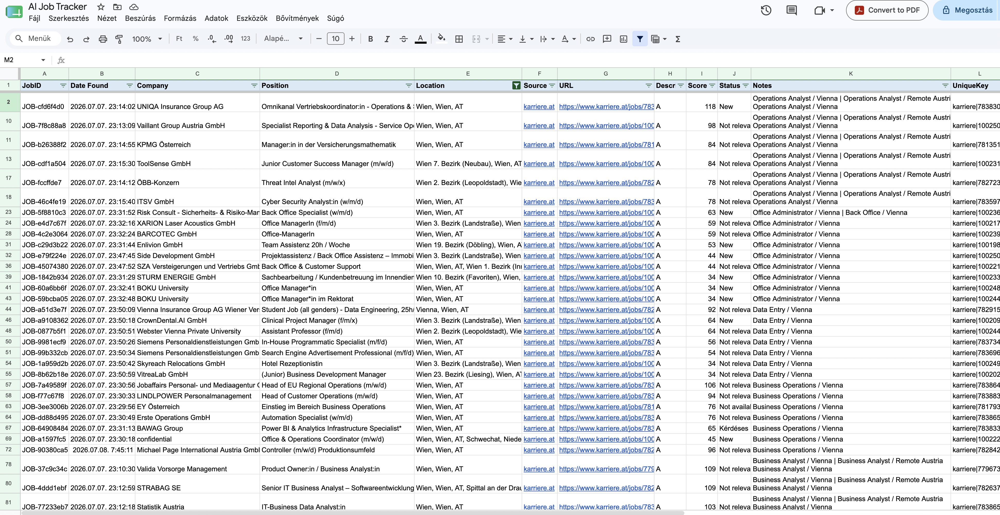

# Automated-Job-Intelligence-Dashboard
## Overview

This project was created to automate one of the most repetitive parts of a job search: monitoring new opportunities across different sources. Instead of manually checking job portals every day and reviewing email notifications, I designed an automated workflow that collects relevant vacancies, removes duplicates and stores them in a single structured dataset.

The goal was not to build another job scraper, but to redesign a manual business process into an automated information pipeline that supports faster decision-making.

## Business Problem

Reviewing job opportunities required visiting recruitment websites, opening LinkedIn email alerts and manually comparing postings that frequently appeared multiple times. The process was repetitive, time-consuming and made it difficult to maintain a consistent overview of the market.

## Solution

I designed an automated workflow that currently combines two information sources:

- job postings collected from Karriere.at based on predefined search criteria;
- LinkedIn job alert emails automatically consolidated into the same dataset.

The workflow standardizes the collected information, identifies duplicate vacancies and stores the results in a central Google Sheets database, creating a single source of truth for daily job monitoring.

## Current Architecture

```
Karriere.at
          \
           \
LinkedIn Email Alerts
             │
             ▼
Google Apps Script
             │
Data Cleaning & Standardisation
             │
Duplicate Detection
             │
Google Sheets Database
             │
Daily Automated Updates
```

## Business Value

The automation significantly reduces the amount of manual work required to monitor the job market. Instead of reviewing multiple sources separately, new opportunities are collected automatically into one structured dataset, making it easier to track vacancies, compare positions and focus on evaluating opportunities rather than searching for them.

From a business analysis perspective, the project demonstrates how a repetitive operational process can be analysed, redesigned and automated using a lightweight ETL workflow and scheduled execution.

## Technologies

- Google Apps Script
- Google Sheets
- Google Workspace Automation
- HTML Parsing
- Regular Expressions
- ETL Workflow Design
- Process Automation

## Skills Demonstrated

This project demonstrates end-to-end solution design rather than simply writing a script. It includes business process analysis, workflow automation, data collection, data quality management, duplicate detection, information standardisation and automated scheduling.

## Demo

Example output from the automated job intelligence database:



## Roadmap

The current version provides the foundation for a scalable Job Market Intelligence platform. Future enhancements focus on improving data coverage, analysis capabilities and decision support.

Planned improvements:

- Integration of additional job sources and career portals
- Configurable search profiles based on roles, skills and locations
- Advanced duplicate detection and job consolidation
- Power BI dashboards for market overview and application tracking
- Trend analysis of job demand, required skills and technologies
- Salary range extraction and market benchmarking
- Automated weekly job market reports and insights
- AI-assisted matching between job requirements and candidate profiles
