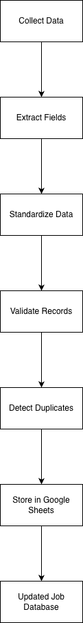

# Workflow

## Overview

The automation executes a scheduled workflow that collects job opportunities from multiple sources, processes the information into a standardized format and stores the results in a centralized dataset.

The objective is to replace repetitive manual monitoring with a consistent, automated process that provides a single source of truth for daily job tracking.

---

## Workflow Steps

### 1. Retrieve Data

The workflow begins by collecting new job opportunities from the configured data sources.

Current sources include:

- Karriere.at job search results
- LinkedIn Job Alert emails

Each source is processed independently before being merged into a common workflow.

---

### 2. Extract Relevant Information

For each job posting, the automation extracts the relevant business information, including:

- Job title
- Company
- Location
- Source
- URL
- Publication date (when available)

The extracted values are mapped into a common data structure.

---

### 3. Standardize the Data

Because each source provides information in a different format, the collected data is standardized before storage.

Typical transformations include:

- removing unnecessary formatting
- normalizing URLs
- trimming whitespace
- aligning field names
- validating mandatory fields

This ensures that all job records follow the same structure regardless of their origin.

---

### 4. Detect Duplicates

Before inserting new records, the workflow checks whether a job posting already exists in the dataset.

Duplicate detection prevents multiple entries for the same vacancy when it appears across different sources or multiple executions.

Only new job postings are added to the database.

---

### 5. Store the Results

Validated records are written into the Google Sheets database.

Each record represents a single standardized job opportunity that can be searched, filtered and analysed.

---

### 6. Scheduled Execution

The workflow is designed for automatic execution using scheduled triggers in Google Apps Script.

This enables the dataset to remain continuously updated without manual intervention.

---

## Current Workflow

---

## Future Enhancements

The workflow has been designed to support future extensions, including:

- additional recruitment platforms
- configurable search profiles
- salary extraction
- AI-assisted job relevance scoring
- automated reporting
- Power BI dashboards
